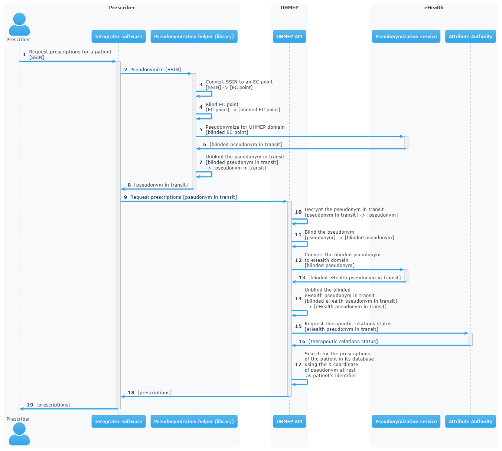

# Introduction

The goal of this document is to describe the ICT ReUse Pseudonymisation .NET library, which helps to use the [eHealth Pseudonymisation service](https://portal.api.ehealth.fgov.be/api-details?apiId=eb8015c0-693b-4c4f-bab9-f671d35ddc15&managerId=1&Itemid=171&catalogModuleId=120), and how to integrate it into your projects.

It also helps to understand the different concepts of pseudonymisation.

This document is intended to be useful to everyone, whether you are in a functional or technical role.

This .NET implementation was developed by RIZIV-INAMI, based on the original Java version by Smals.

# Prerequisite

It is strongly recommended to read the [eHealth Pseudonymisation service](https://portal.api.ehealth.fgov.be/api-details?apiId=eb8015c0-693b-4c4f-bab9-f671d35ddc15&managerId=1&Itemid=171&catalogModuleId=120) documentation before reading this document.

# Definitions 

**Identifier**
An identifier is a unique code that identifies a citizen without requiring additional information. The most common identifier in Belgium is the social security number (rijksregisternummer/numéro de registre national). The eHealth Pseudonymisation service only exchanges elliptic curve points, not identifiers. Each identifier must be converted to an elliptic curve point before exchange. Conversely, an elliptic curve point must be converted into an identifier before it can be used by the user/system.

**EC point (Elliptic Curve point)**
Point on an elliptic curve. The elliptic curve used by the eHealth Pseudonymisation service is P-521.

**Blinding**
An EC point is \'blinded\' if it has been modified before being sent and if it cannot be found or seen by another user/system. Only the user/system that blinded the EC point can unblind it, as he is the only one who knows how to unblind it. It can be seen as encryption with a private single-use key. Blinding an EC point ensures that nobody can map an identifier to a pseudonym at rest, or a pseudonym from one domain to a pseudonym from another domain.

**Pseudonym (at rest)**
A pseudonym is an EC point associated with one citizen in a specific domain (see below). Hence, pseudonyms have only local significance. This means that a pseudonym does not allow someone to know the real citizen behind it without additional information. eHealth converts (pseudonymises) an EC point into a pseudonym by applying a complex operation on the EC point. This operation is securely done by an HSM (Hardware Security Module) that knows which operation to apply to the EC points. The HSM is also used to revert the operation: to convert (identify) a pseudonym into an EC point. Sensitive data can be linked together using this local pseudonym, but it is not sufficient to link this data to the real person outside of this domain. Sensitive data must of course be encrypted if it contains information that can help to identify the real person outside of this domain. A pseudonym enables the linkage of records belonging to the same citizen, without the need to identify the real citizen behind it. The pseudonym can be stored in a database or any secure storage system, but it cannot be exchanged with external users/systems.

**Pseudonym in transit**
A pseudonym in transit is a pseudonym with extra protection layer that are only present during transit. By \'transit\', we mean during the exchange of this pseudonym from one system/person to another system/person.

**Domain**
A domain is a set of pseudonymised data, meaning a domain consists of multiple records in the form of pseudonym-data. Each pseudonym is associated with a single domain and has meaning only within that domain. A domain could be a specific backend database or a pseudonymised dataset required for a specific research project. Domains should never overlap. Hence, domains can be thought of as separate islands; on each island, the citizen is known only by their island-specific pseudonym.

# Use case example
This section aims to explain the use of pseudonymisation in a real use case. It will focus on the manipulation of the patient identifier and the returned data. This means that it will list the operations to apply on the identifier/data, but it will not explain how the library will do it technically.

In this example, a prescriber will consult prescriptions for a patient using an integrator software. The back-end (called UHMEP in our example) will call an external eHealth service (Attribute Authority) to verify the therapeutic relations (therapeutic link + exclusion) to determine if the prescriptions can be returned. Once this check is done, the prescriptions will be returned to the prescriber. An explanatory text of the diagram is present just after it.

{alt="use case 1"}

1-2

:   The patient identifier cannot be given to the back-end application. The integrator software will then use the library to pseudonymise the identifier, which is the Belgian Social Security Identification Number (SSIN), into a pseudonym in transit for the domain of the targeted back-end (UHMEP API in this case).

3-8

:   The library will convert this identifier to a point on the elliptic curve (EC point), blind this EC point, and call the pseudonymize` operation of the eHealth Pseudonymisation service. The response will be unblinded and returned to the software. Blinding is necessary for each call to the eHealth Pseudonymisation service to prevent this service from seeing any kind of patient identifier (SSIN, pseudonym at rest).

9

:   The pseudonym in transit returned by the library can be used to request prescriptions from the back-end.

10

:   This pseudonym in transit will be decrypted by the back-end to remove the protection layer present during data exchange. The result of this decryption is called the pseudonym at rest, which will be stored in the back-end database. This pseudonym at rest will always be the same if the patient identifier is the same, which is not the case for the pseudonym in transit: it will always be different.

11-17

:   This pseudonym at rest can be used to retrieve the patient's prescriptions, but first, the back-end needs to verify if those prescriptions can be consulted by the prescriber by checking the therapeutic relations. To do this, the back-end must call an external eHealth service and communicate for which patient the verification must be done. This will be done by providing a pseudonym in transit for the domain \"eHealth\". To obtain this pseudonym, the back-end converts its pseudonym at rest to a pseudonym in transit for eHealth. Once the verification is done, the back-end can return the prescriptions with a new pseudonym i transit for the patient information (by encrypting the pseudonym at rest).

18

:   The integrator software can use the library to link this pseudonym in transit to the original identifier. In this case, this last call is not necessary but will be if the prescriber consults prescriptions he created and then receives prescriptions for many patients.

# Nuget Package

To use the library in your project, you need to add the Nuget package `Nihdi.Common.Pseudonymisation`. The package is available on Nuget.org: <https://www.nuget.org/packages/Nihdi.Common.Pseudonymisation/>.

# Initialization PseudonymisationHelper

PseudonymisationHelper is initialized using a builder which requires specific parameters to be provided. This guide outlines the steps and parameters needed for a successful initialization.

**Parameters**

Ensure that you have the required parameters for initialization:

- **Name**: **pseudonymisationClient**

  - **Type**: `IPseudonymisationClient`

  - **Description**: The `IPseudonymisationClient` interface used to
    make calls to eHealth Pseudonymisation service.

- **Name**: **jwksUrl**

  - **Type**: `Uri`

  - **Description**: The JSON Web Key Set URL used by eHealth
    Pseudonymisation service to encrypt the domain secret keys. It
    **must** be exactly the URL defined in eHealth Pseudonymisation
    service.

If you are not sure about the URL referenced in eHealth Pseudonymisation
service, you can use your `PseudonymisationClient` to retrieve your
domain, and check your JSON Web Key Set URL.

- **Name**: **jwksSupplier**

  - **Type**: `Func<Task<string>>?`

  - **Description**: A supplier of the JSON Web Key Set (as String)
    pointed by `jwksUrl`.

- **Name**: **privateKeySupplier**

  - **Type**: `Func<string, Task<string>>`

  - **Description**: A function supplying the private keys that are
    defined in the JWKS supplied by `jwksSupplier`.


Only `pseudonymisationClient` is mandatory in all use cases.

When you need to encrypt or decrypt pseudonyms in transit (in other
words: if you are the owner of at least one domain), you also have to
provide `jwksUrl`, `jwksSupplier` and `privateKeySupplier`.

For example, the software of a physician only needs to provide
`pseudonymisationClient`.

**Code snippet**

PseudonymizationHelper initialization example

``` cs
        var helper =
            PseudonymisationHelper.Builder()
            .JwksUrl(new Uri("https://api.ehealth.fgov.be/etee/v1/pubKeys/cacerts/jwks?identifier=0406798006&type=CBE&applicationIdentifier=UHMEP&use=enc"))
            .JwkSupplier(() => Task.FromResult("..."))
            .PseudonymisationClient(new PseudonymisationClient())
            .PrivateKeySupplier(domainKey => "...")
            .Build();
```

``` cs
    public class PseudonymisationClient : IPseudonymisationClient
    {
        public Task<string> ConvertTo(string fromDomainKey, string toDomainKey, string payload)
        {
            throw new NotImplementedException();
        }

        public Task<string> ConvertMultipleTo(string fromDomainKey, string toDomainKey, string payload)
        {
            throw new NotImplementedException();
        }

        public Task<string> GetDomain(string domainKey)
        {
            throw new NotImplementedException();
        }

        public Task<string> Identify(string domainKey, string payload)
        {
            throw new NotImplementedException();
        }

        public Task<string> IdentifyMultiple(string domainKey, string payload)
        {
            throw new NotImplementedException();
        }

        public Task<string> Pseudonymize(string domainKey, string payload)
        {
            throw new NotImplementedException();
        }

        public Task<string> PseudonymizeMultiple(string domainKey, string payload)
        {
            throw new NotImplementedException();
        }
    }
```

You only have to implement the methods of PseudonymisationClient that you really need. If you only need to pseudonymise and identify single values, then you only have to implement identify() and pseudonymize(). The only method that is mandatory is getDomain().

Methods of IPseudonymizationClient

``` cs
    /// <summary>
    /// Call to /pseudo/v1/domains/{domainKey} and return the response as a
    /// String.
    /// Each call to this method <strong>must</strong> make a call to eHealth
    /// pseudonymisation service: please do not return a cached response.
    /// </summary>
    /// <param name="domainKey">The domain key.</param>
    /// <returns>The response as a string.</returns>
    Task<string> GetDomain(string domainKey);

    /// <summary>
    /// Call to /pseudo/v1/domains/{domainKey}/identify with the given
    /// payload and return the response as a String.
    /// </summary>
    /// <param name="domainKey">The domain key.</param>
    /// <param name="payload">The request body.</param>
    /// <returns>the response as a string.</returns>
    Task<string> Identify(string domainKey, string payload);

    /// <summary>
    /// Call to /pseudo/v1/domains/{domainKey}/identify with the given
    /// payload and return the response as a String.
    /// </summary>
    /// <param name="domainKey">The domain key.</param>
    /// <param name="payload">The request body.</param>
    /// <returns>the response as a string.</returns>
    Task<string> IdentifyMultiple(string domainKey, string payload);

    /// <summary>
    /// Call to /pseudo/v1/domains/{domainKey}/pseudonymize with the given
    /// payload and return the response as a String.
    /// </summary>
    /// <param name="domainKey">The domain key.</param>
    /// <param name="payload">The request body.</param>
    /// <returns>the response as a string.</returns>
    Task<string> Pseudonymize(string domainKey, string payload);

    /// <summary>
    /// Call to /pseudo/v1/domains/{domainKey}/pseudonymizeMultiple with the
    /// given payload and return the response as a String.
    /// </summary>
    /// <param name="domainKey">The domain key.</param>
    /// <param name="payload">The request body.</param>
    /// <returns>the response as a string.</returns>
    Task<string> PseudonymizeMultiple(string domainKey, string payload);

    /// <summary>
    /// Call to /pseudo/v1/domains/{fromDomainKey}/convertTo/{toDomainKey}
    /// with the given payload and return the response as a String.
    /// </summary>
    /// <param name="fromDomainKey">The domain of the pseudonym to convert.</param>
    /// <param name="toDomainKey">The target domain.</param>
    /// <param name="payload">The request body.</param>
    /// <returns>The response as a string.</returns>
    Task<string> ConvertTo(string fromDomainKey, string toDomainKey, string payload);

    /// <summary>
    /// Call to /pseudo/v1/domains/{fromDomainKey}/convertToMultiple/{toDomainKey}
    /// with the given payload and return the response as a String.
    /// </summary>
    /// <param name="fromDomainKey">The domain of the pseudonym to convert.</param>
    /// <param name="toDomainKey">The target domain.</param>
    /// <param name="payload">The request body.</param>
    /// <returns>The response as a string.</returns>
    Task<string> ConvertMultipleTo(string fromDomainKey, string toDomainKey, string payload);
```

# Explanation of PseudonymisationHelper
`PseudonymisationHelper` primarily provides `IDomain` instances, which
are essentially sets of factories that allow you to create different
objects you can manipulate to apply pseudonymisation operations.

The first step after the initialization is to retrieve a domain.

`GetDomain()` will use the `PseudonmymisationClient` you provided in the
constructor to call eHealth Pseudonymisation service. This call is
asynchronous and that's why it returns a `Task<string>`.

Your `PseudonmymisationClient` must call eHealth Pseudonymisation
service for the domains you need to encrypt/decrypt transitInfo. For the
other domains, your `PseudonmymisationClient` should return a hardcoded
representation of the domain.

Example with hardcoded `ehealth_v1` domain

``` cs
public class MyPseudonymisationClient : IPseudonymisationClient
{
    public Task<string> GetDomain(string domainKey)
    {
        if (domainKey == "ehealth_v1")
        {
            return Task.FromResult(
                "{\n" +
                "  \"audience\": \"https://api.ehealth.fgov.be/pseudo/v1/domains/ehealth_v1\",\n" +
                "  \"bufferSize\": 8,\n" +
                "  \"timeToLiveInTransit\": \"PT10M\",\n" +
                "  \"domain\": \"ehealth_v1\"\n" +
                "}");
        }

        // Add here your implementation that calls eHealth Pseudonymisation service

        throw new ArgumentException($"Could not find domain {domainKey}");
    }
```

Example that retrieve the `uhmep_v1` domain

``` cs
        IDomain? domain = await pseudonymisationHelper.GetDomain("uhmep_v1");
```

Main classes used by the library as parameter or return types are
described bellow.

## Domain 

The Domain object represents your or a foreign Domain. The object
contains methods to access to the factory.

Methods

``` cs
/// <summary>
/// Represents a domain for pseudonymisation operations, providing factories and configuration
/// for pseudonym generation and management.
/// </summary>
public interface IDomain
{
    /// <summary>
    /// Gets the key for this domain.
    /// </summary>
    /// <value>A string that represents the key of this pseudonymisation domain.</value>
    public string? Key
    {
        get;
    }

    /// <summary>
    /// Gets the factory responsible for creating values within this domain.
    /// </summary>
    /// <value>The value factory implementation for this domain.</value>
    public IValueFactory ValueFactory
    {
        get;
    }

    /// <summary>
    /// Gets the factory responsible for creating pseudonyms within this domain.
    /// </summary>
    /// <value>The pseudonym factory implementation for this domain.</value>
    public IPseudonymFactory PseudonymFactory
    {
        get;
    }

    /// <summary>
    /// Gets the factory responsible for creating pseudonyms that are in transit between systems.
    /// </summary>
    /// <value>The pseudonym-in-transit factory implementation for this domain.</value>
    /// public IPseudonymInTransitFactory PseudonymInTransitFactory
    public IPseudonymInTransitFactory PseudonymInTransitFactory
    {
        get;
    }

    /// <summary>
    /// Gets the buffer size used for pseudonymisation operations within this domain.
    /// </summary>
    /// <value>An integer representing the size of the buffer.</value>
    int BufferSize
    {
        get;
    }
}
```

## ValueFactory 

The ValueFactory allows the creation of `Value` objects, such as a clear
identifier to be pseudonymised. It serves as the entry point to
pseudonymise an identifier or a string, or as the output when a
pseudonym is identified (de-pseudonymised).

Even though it is technically possible to have values longer than 32
bytes, eHealth requires that this 32-byte limit is not exceeded.

``` cs
/// <summary>
/// Wrapper around an elliptic curve point representing a value, that provides useful methods to manipulate it.
/// </summary>
public interface IValue : IPoint
{
    /// <summary>
    /// Returns the value as bytes array.
    /// Use it for non-text values.
    /// </summary>
    /// <returns>The value as a bytes array.</returns>
    byte[] AsBytes();

    /// <summary>
    /// Returns the value as String.
    /// Convenient method that converts the bytes array to a String.
    /// Use it only for text values for which you called <see cref="IValueFactory.From(string, Encoding)"/>.
    /// </summary>
    /// <param name="encoding">The encoding to use for the conversion.</param>
    /// <returns>The value as a string.</returns>
    string AsString(Encoding encoding);

    /// <summary>
    /// Returns the value as a String.
    /// Convenient method that converts the bytes array (representing UTF-8) to a string.
    /// Use it for text values.
    /// </summary>
    /// <returns>The value as string.</returns>
    string AsString();

    /// <summary>
    /// Pseudonymize this <see cref="IValue"/>.
    /// </summary>
    /// <returns>
    /// A random <see cref="IPseudonymInTransit"/> for this <see cref="IValue"/>.
    /// </returns>.
    Task<IPseudonymInTransit> Pseudonymize();
}
```

## PseudonymFactory 

The PseudonymFactory is responsible for creating Pseudonym objects from
points on the curve X and Y. If the point is invalid then
InvalidPseudonymException is raised.

When you store a pseudonym from your persistent system (database, for
example), you should store the X coordinate of the point, and use the
PseudonymFactory to create the Pseudonym from the X coordinate. If, for
performance reasons, you also store the Y coordinate in your persistence
system, then you can also provide it to the PseudonymFactory: this will
avoid computing the Y coordinate and will save a substantial amount of
CPU resources.

If you don't have performance issues in computing the Y coorrdinate, it
is recommended to only store the X coordinate in your persistence
system.

If you decide to store the Y coordinate in your persistence system, you
should not define the X-Y pair as a unique identifier: only the X should
be used as an identifier because you have no guarantee that the user who
will call your API will provide the same Y coordinate you stored in your
persistence system.

``` cs
/// <summary>
/// Wrapper around an elliptic curve point representing a value, that provides useful methods to manipulate it.
/// </summary>
public interface IValue : IPoint
{
    /// <summary>
    /// Returns the value as bytes array.
    /// Use it for non-text values.
    /// </summary>
    /// <returns>The value as a bytes array.</returns>
    byte[] AsBytes();

    /// <summary>
    /// Returns the value as String.
    /// Convenient method that converts the bytes array to a String.
    /// Use it only for text values for which you called <see cref="IValueFactory.From(string, Encoding)"/>.
    /// </summary>
    /// <param name="encoding">The encoding to use for the conversion.</param>
    /// <returns>The value as a string.</returns>
    string AsString(Encoding encoding);

    /// <summary>
    /// Returns the value as a String.
    /// Convenient method that converts the bytes array (representing UTF-8) to a string.
    /// Use it for text values.
    /// </summary>
    /// <returns>The value as string.</returns>
    string AsString();

    /// <summary>
    /// Pseudonymize this <see cref="IValue"/>.
    /// </summary>
    /// <returns>
    /// A random <see cref="IPseudonymInTransit"/> for this <see cref="IValue"/>.
    /// </returns>.
    Task<IPseudonymInTransit> Pseudonymize();
}
```

## PseudonymInTransitFactory 

This factory allows to create PseudonymInTransit objects from a
pseudonym and a transitInfo.

``` cs
/// <summary>
/// Defines a factory for creating pseudonym-in-transit objects with various initialization methods.
/// </summary>
/// <remarks>
/// This factory provides methods to create individual pseudonyms from different data formats
/// as well as collections of multiple pseudonyms.
/// </remarks>
public interface IPseudonymInTransitFactory
{
    /// <summary>
    /// Creates a pseudonym-in-transit object from X and Y coordinates and transit information.
    /// </summary>
    /// <param name="x">The Base64 string representation of the X coordinate of the pseudonym.</param>
    /// <param name="y">The Base64 string representation of the Y coordinate of the pseudonym.</param>
    /// <param name="transitInfo">The standard JWE compact representation (Base64 URL encoded String) of the transitInfo.
    /// which contains the scalar that will be used to unblind the given pseudonym.
    /// </param>
    /// <returns>A new <see cref="IPseudonymInTransit"/> instance created from the given coordinates
    /// and transit info.
    /// </returns>
    IPseudonymInTransit FromXYAndTransitInfo(string x, string y, string transitInfo);

    /// <summary>
    /// Creates a <see cref="IPseudonymInTransit"/>  from the given SEC 1 representation
    /// of the elliptic curve point and transit info.
    /// </summary>
    /// <param name="sec1AndTransitInfo">Base64 URL string representation (without padding)
    ///  of the SEC 1 encoded point (can be SEC 1 compressed or uncompressed format),
    /// followed by <c>:</c>, and by the standard JWE compact representation
    /// (Base64 URL encoded String) of the transitInfo which contains the scalar
    ///  will be used to unblind the given point coordinates (pseudonym).
    /// </param>
    /// <returns>
    /// A <see cref="IPseudonymInTransit"/> instance created from the given <c>sec1AndTransitInfo</c>.
    /// </returns>
    IPseudonymInTransit FromSec1AndTransitInfo(string sec1AndTransitInfo);

    /// <summary>
    /// Creates an empty collection for multiple pseudonyms in transit.
    /// </summary>
    /// <returns>A new <see cref="IMultiplePseudonymInTransit"/> collection instance.</returns>
    IMultiplePseudonymInTransit Multiple();

    /// <summary>
    /// Creates a <see cref="IMultiplePseudonymInTransit"/> containing the items
    /// given in the provided <see cref="Collection{IPseudonymInTransit}"/>.
    /// The items (references) of the given collection are copied to the new instance.
    /// Changes done to the given collection after this call will not be reflected
    /// in the created instance.
    /// </summary>
    /// <param name="pseudonymsInTransit"><see cref="Collection{IPseudonymInTransit}"/>
    /// of pseudonyms to copy to the returned <see cref="IMultiplePseudonymInTransit"/>.</param>
    /// <returns>A new <see cref="IMultiplePseudonymInTransit"/> collection instance containing the provided pseudonyms.</returns>
    IMultiplePseudonymInTransit Multiple(Collection<IPseudonymInTransit> pseudonymsInTransit);
}
```

## Value 

A Value object represents a clear identifier, this object allows to
pseudonymize an identifier.

``` cs
/// <summary>
/// Wrapper around an elliptic curve point representing a value, that provides useful methods to manipulate it.
/// </summary>
public interface IValue : IPoint
{
    /// <summary>
    /// Returns the value as bytes array.
    /// Use it for non-text values.
    /// </summary>
    /// <returns>The value as a bytes array.</returns>
    byte[] AsBytes();

    /// <summary>
    /// Returns the value as String.
    /// Convenient method that converts the bytes array to a String.
    /// Use it only for text values for which you called <see cref="IValueFactory.From(string, Encoding)"/>.
    /// </summary>
    /// <param name="encoding">The encoding to use for the conversion.</param>
    /// <returns>The value as a string.</returns>
    string AsString(Encoding encoding);

    /// <summary>
    /// Returns the value as a String.
    /// Convenient method that converts the bytes array (representing UTF-8) to a string.
    /// Use it for text values.
    /// </summary>
    /// <returns>The value as string.</returns>
    string AsString();

    /// <summary>
    /// Pseudonymize this <see cref="IValue"/>.
    /// </summary>
    /// <returns>
    /// A random <see cref="IPseudonymInTransit"/> for this <see cref="IValue"/>.
    /// </returns>.
    Task<IPseudonymInTransit> Pseudonymize();
}
```

## Pseudonym 

A Pseudonym object represents a point X and Y in a curve.

``` cs
/// <summary>
/// Wrapper around an elliptic curve point that provides useful methods to manipulate eHealth pseudonyms.
/// </summary>
public interface IPseudonym : IPoint
{
    /// <summary>
    ///  Base64 URL encoded uncompressed SEC1 Elliptic-Curve-Point-to-Octet-String Conversion of this point.
    /// </summary>
    /// <returns>@return Base64 URL encoded the uncompressed SEC1 Elliptic-Curve-Point-to-Octet-String Conversion of this point.</returns>
    string AsString();

    /// <summary>
    /// Compressed SEC 1 representation of this point.
    /// </summary>
    /// <returns>SEC 1 representation of this point.</returns>
    string AsShortString();

    /// <summary>
    /// Convert this <see cref="IPseudonym"/> into a <see cref="IPseudonymInTransit"/>.
    /// </summary>
    /// <param name="toDomain">The target domain for the returned <see cref="IPseudonymInTransit"/>.</param>
    /// <returns>
    /// A <see cref="IPseudonymInTransit"/> for the given domain, matching this <see cref="IPseudonym"/>.
    /// </returns>
    Task<IPseudonymInTransit> ConvertTo(IDomain toDomain);

    /// <summary>
    /// Create <see cref="IPseudonymInTransit"/> from this <see cref="IPseudonym"/>
    /// Use this method to convert a pseudonym at rest into a <see cref="IPseudonymInTransit"/> that you can send externally.
    /// The scalar in transitInfo is encoded in Base64.
    /// </summary>
    /// <returns>A <see cref="IPseudonymInTransit"/> with X and Y blinded by a scalar (which is encrupted an put in transitInfo).</returns>
    IPseudonymInTransit InTransit();

    /// <summary>
    /// Create <see cref="IPseudonymInTransit"/> from this <see cref="IPseudonym"/>
    /// Use this method to convert a pseudonym at rest into a <see cref="IPseudonymInTransit"/> that you can send externally.
    /// The scalar in transitInfo is encoded in Base64.
    /// </summary>
    /// <param name="transitInfoCustomizer">Customizer to customize the transit info (for example to add a target domain).</param>
    /// <returns>
    /// A <see cref="IPseudonymInTransit"/> with X and Y blinded by a scalar (which is encrupted an put in transitInfo).
    /// </returns>
    IPseudonymInTransit InTransit(ITransitInfoCustomizer transitInfoCustomizer);
}
```

## TransitInfo 

A TransitInfo object represents the JWECompact transitInfo.

``` cs
/// <summary>
/// Wrapper around an elliptic curve point that provides useful methods to manipulate eHealth pseudonyms.
/// </summary>
public interface IPseudonym : IPoint
{
    /// <summary>
    ///  Base64 URL encoded uncompressed SEC1 Elliptic-Curve-Point-to-Octet-String Conversion of this point.
    /// </summary>
    /// <returns>@return Base64 URL encoded the uncompressed SEC1 Elliptic-Curve-Point-to-Octet-String Conversion of this point.</returns>
    string AsString();

    /// <summary>
    /// Compressed SEC 1 representation of this point.
    /// </summary>
    /// <returns>SEC 1 representation of this point.</returns>
    string AsShortString();

    /// <summary>
    /// Convert this <see cref="IPseudonym"/> into a <see cref="IPseudonymInTransit"/>.
    /// </summary>
    /// <param name="toDomain">The target domain for the returned <see cref="IPseudonymInTransit"/>.</param>
    /// <returns>
    /// A <see cref="IPseudonymInTransit"/> for the given domain, matching this <see cref="IPseudonym"/>.
    /// </returns>
    Task<IPseudonymInTransit> ConvertTo(IDomain toDomain);

    /// <summary>
    /// Create <see cref="IPseudonymInTransit"/> from this <see cref="IPseudonym"/>
    /// Use this method to convert a pseudonym at rest into a <see cref="IPseudonymInTransit"/> that you can send externally.
    /// The scalar in transitInfo is encoded in Base64.
    /// </summary>
    /// <returns>A <see cref="IPseudonymInTransit"/> with X and Y blinded by a scalar (which is encrupted an put in transitInfo).</returns>
    IPseudonymInTransit InTransit();

    /// <summary>
    /// Create <see cref="IPseudonymInTransit"/> from this <see cref="IPseudonym"/>
    /// Use this method to convert a pseudonym at rest into a <see cref="IPseudonymInTransit"/> that you can send externally.
    /// The scalar in transitInfo is encoded in Base64.
    /// </summary>
    /// <param name="transitInfoCustomizer">Customizer to customize the transit info (for example to add a target domain).</param>
    /// <returns>
    /// A <see cref="IPseudonymInTransit"/> with X and Y blinded by a scalar (which is encrupted an put in transitInfo).
    /// </returns>
    IPseudonymInTransit InTransit(ITransitInfoCustomizer transitInfoCustomizer);
}
```

## PseudonymInTransit

A PseudonymInTransit object represents a pseudonymInTransit that
contains a Pseudonym and TransitInfo objects.

``` cs
/// <summary>
/// A pseudonym in transit is a pseudonym that is encrypted for transit between two domains.
/// </summary>
public interface IPseudonymInTransit : IPoint
{
    /// <summary>
    ///  Returns the <see cref="IPseudonym"/> of this <see cref="IPseudonymInTransit"/>.
    /// </summary>
    /// <returns>
    /// The <see cref="IPseudonym"/> of this <see cref="IPseudonymInTransit"/>.
    /// </returns>
    IPseudonym Pseudonym();

    /// <summary>
    /// Gets the <see cref="ITransitInfo"/> of this <see cref="IPseudonymInTransit"/>.
    /// </summary>
    /// <returns>The <see cref="ITransitInfo"/>.</returns>
    ITransitInfo GetTransitInfo();

    /// <summary>
    /// Returns the standard string representation of this <see cref="IPseudonymInTransit"/>.
    /// It returns the Base64 URL representation of the uncompressed SEC 1 representation of the point
    /// followed by `:` and by the string representation of the <see cref="ITransitInfo" /> (JWE compact).
    /// Only use this method instead of <see cref="AsShortString"/>  when the length of the string is not very important,
    /// because it spares the recipient of this <see cref="IPseudonymInTransit"/> to compute the point's Y coordinate.
    /// </summary>.
    /// <returns>The standard String representation of this <see cref="IPseudonymInTransit"/>.</returns>
    string AsString();

    /// <summary>
    /// Returns the short string representation of this <see cref="IPseudonymInTransit"/>.
    /// It returns the Base64 URL representation of the compressed SEC 1 representation of the point
    /// followed by `:` and by the string representation of the <see cref="ITransitInfo"/> (JWE compact).
    /// Only use this method instead of <see cref="AsString"/>  when you need to shorten the string (to prevent a too long URL, for example).
    /// The drawback is that the recipient of this <see cref="IPseudonymInTransit"/> will have to compute the Y coordinate of the point.
    /// </summary>.
    /// <returns>The standard String representation of this <see cref="IPseudonymInTransit"/>.</returns>
    string AsShortString();

    /// <summary>
    /// Identify (de-pseudonymise) this <see cref="IPseudonymInTransit"/>.
    /// </summary>
    /// <returns>The identified <see cref="IPseudonym"/> as <see cref="Task{IValue}"/>.</returns>
    Task<IValue> Identify();

    /// <summary>
    /// Decrypt the pseudonym in transit.
    /// <c>iat</c> and <c>exp</c> must be valid: it calls <see cref="AtRest(bool)"/> with <c>true</c>.
    /// </summary>
    /// <returns>The pseudonym at rest.</returns>
    IPseudonym? AtRest();

    /// <summary>
    /// Decrypt the pseudonym in transit.
    /// In regular case, you should not use this method: you should use
    /// <see cref="AtRest()"/>  instead.
    /// Only use this method if you need to recover an expired
    ///  <see cref="IPseudonymInTransit"/> , for example.
    /// </summary>
    /// <param name="validateIatAndExp">Must iat and exp be validated ?.</param>
    /// <returns>The pseudonym at rest.</returns>
    IPseudonym? AtRest(bool validateIatAndExp);

    /// <summary>
    /// Convert this <see cref="IPseudonymInTransit"/> into a <see cref="IPseudonymInTransit"/> for the given domain.
    /// <paramref name="toDomain" /> the target domain for the returned <see cref="IPseudonymInTransit"/>.
    /// </summary>
    /// <param name="toDomain">The target domain for the returned <see cref="IPseudonymInTransit"/>.</param>
    /// <returns>A <see cref="IPseudonymInTransit"/> for the given domain,
    /// matching this <see cref="IPseudonymInTransit"/>.
    /// </returns>
    Task<IPseudonymInTransit> ConvertTo(IDomain toDomain);
}
```

# Use of PseudonymisationHelper in real use cases 

These examples demonstrate how to use PseudonymisationHelper for common
use cases.

Most of the use cases can be done synchronously or asynchronously. To
avoid writing too much code here, we will provide few examples in both
synchronous and asynchronous ways.

## Pseudonymise an SSIN 

In this example, as a user of a pseudonymised REST API, I want to
pseudonymise a citizen's SSIN before sending my request to the REST API.

Synchronous code

``` cs
  var pseudonym =
      _pseudonymisationHelper
          .GetDomain("uhmep_v1").Result?
          .ValueFactory
          .From("00000000097")
          .Pseudonymize().Result;
```
::::

Asynchronous code

``` cs
  var domain = await _pseudonymisationHelper.GetDomain("uhmep_v1");

  if (domain == null)
  {
      return null;
  }

  var pseudonym = await domain.ValueFactory
          .From("00000000097")
          .Pseudonymize();
```

## Pseudonymise a string 

eHealth asks not to pseudonymise values that exceed 32 bytes. Depending on the encoding, 32 bytes does not mean 32 characters. `ValueFactory` first converts the string into a byte\[\] using the given `Charset` (UTF-8 by default). You can use any Charset you want to have better control over the string-to-bytes conversion, and consequently, better control over the byte array size.

Using default Charset (UTF-8)

``` cs
  var pseudonym =
      _pseudonymisationHelper
          ?.GetDomain("uhmep_v1")
          ?.Result
          ?.ValueFactory
          .From("Cédric Dupont")
          .Pseudonymize().Result;
```
Using ISO-88659-1 Charset

``` cs
  var pseudonym =
      _pseudonymisationHelper
          ?.GetDomain("uhmep_v1")
          ?.Result
          ?.ValueFactory
          .From("Cédric Dupont", Encoding.GetEncoding("ISO-8859-1"))
          .Pseudonymize()
          .Result;
```

**Note**

In the first example, the byte array length will be 14; in the second
one, it will be 13.

## Pseudonymise an AES encryption key 

In some use cases, we have to encrypt sensitive data before sending it
to a REST API. The goal is for the REST API to store it in its database
so that it can be returned to another user of the API later. For this,
the other user must also receive the encryption key. The REST API should
not be able to decrypt the information, so the encryption key must also
be pseudonymised.

Synchronous code

``` cs
  byte[] secretKey = GeneraSecretKey(32);
  var base64UrlEncodedKey = Base64UrlEncoder.Encode(secretKey);

  var pseudonym =
      _pseudonymisationHelper
          ?.GetDomain("uhmep_v1")
          ?.Result
          ?.ValueFactory
          .From(base64UrlEncodedKey)
          .Pseudonymize().Result;
```

Asynchronous code

``` cs
  byte[] secretKey = GeneraSecretKey(32);
  var base64UrlEncodedKey = Base64UrlEncoder.Encode(secretKey);

  var domain = await _pseudonymisationHelper.GetDomain("uhmep_v1");

  if (domain != null)
  {
      var pseudonym = await domain
          .ValueFactory
          .From(base64UrlEncodedKey)
          .Pseudonymize();
  }
```

## Pseudonymise multiple SSINs 

Synchronous code

``` cs
  var domain = await _pseudonymisationHelper.GetDomain("uhmep_v1");

  if (domain == null)
  {
      throw new InvalidOperationException("domain cannot be null");
  }

  var multiplePseudonymInTransit =
      domain.ValueFactory
      .Multiple(
          new[] { "00000000097", "00000000196", "00000000295" }
          .Select(ssin => domain.ValueFactory.From(ssin))
      .ToArray())
      .Pseudonymize().Result;

  for (int i = 0; i < multiplePseudonymInTransit.Size(); i++)
  {
      try
      {
          var pseudonymInTransit = multiplePseudonymInTransit[i];
          // Add your implementation here
      }
      catch (EHealthProblemException e)
      {
          var problem = e.Problem;
          // Add your implementation here
      }
  }
```

## Identify an SSIN returned by a REST API 

As a user of a REST API, I want to identify (de-pseudonymise) the SSIN the REST API sent to me.

Synchronous code

``` cs
  var ssin =
      _pseudonymisationHelper
      .GetDomain("uhmep_v1")?.Result?
      .PseudonymInTransitFactory
      .FromSec1AndTransitInfo("...")
      .Identify().Result
      .AsString();
```

Asynchronous code

``` cs
  var domain =
      await _pseudonymisationHelper.GetDomain("uhmep_v1");

  if (domain == null)
  {
      throw new InvalidOperationException("domain cannot be null");
  }

  var value = await
      domain.PseudonymInTransitFactory
      .FromSec1AndTransitInfo("...")
      .Identify();

  var ssin = value.AsString();
```
## Identify multiple SSINs returned by a REST API 

Asynchronous code

``` cs
  var domain = await _pseudonymisationHelper.GetDomain("uhmep_v1");

  if (domain == null)
  {
      throw new InvalidOperationException("domain cannot be null");
  }

  var factory = domain.PseudonymInTransitFactory;
  var pseudonymsInTransit = new Collection<IPseudonymInTransit>
  {
      factory.FromSec1AndTransitInfo("..."),
      factory.FromSec1AndTransitInfo("..."),
      factory.FromSec1AndTransitInfo("...")
  };

  var multiplePseudonymInTransit = factory.Multiple(pseudonymsInTransit);
  var multipleValue = await multiplePseudonymInTransit.Identify();

  for (int i = 0; i < multipleValue.Size(); i++)
  {
      try
      {
          var pseudonymInTransit = multipleValue[i];
          // Add your implementation here
      }
      catch (EHealthProblemException e)
      {
          var problem = e.Problem;
          // Add your implementation here
      }
  }
```

## Resolve a pseudonym at rest from a pseudonym in transit 

As a REST API, I want to get the pseudonym at rest (always the same for a citizen in a pseusonymisation domain) from a pseudonym in transit to find information about a citizen in my database.

Synchronous code

``` cs
  var domain = _pseudonymisationHelper.GetDomain("uhmep_v1").Result;

  if (domain == null)
  {
      throw new InvalidOperationException("domain cannot be null");
  }

  var pseudonymAtRest =
      domain
      .PseudonymInTransitFactory
      .FromSec1AndTransitInfo("...")
      .AtRest()?
      .X();

  // We assume patientInfoService is the service that allows you to
  // retrieve information about a patient from your database.
  // Please note that you should only save the `x` coordinate in the
  // database.

  var patientInfo = _patientInfoService.GetByPseudonym(pseudonymAtRest);
```

## Generate a pseudonym in transit from a pseudonym at rest 

As a REST API, I want to pseudonymise a citizen's SSIN before to send it to my user.

Synchronous code

``` cs
  var domain = _pseudonymisationHelper.GetDomain("uhmep_v1");

  if (domain == null)
  {
      throw new InvalidOperationException("domain cannot be null");
  }

  var pseudonymInTransit =
      domain.Result?
      .PseudonymFactory
      .FromX("...")
      .InTransit()
      .AsString();
```
Due to potential clock desynchronization, the library permits the use of a pseudonym that has expired within the last minute (i.e., when the `exp` is reached). After this period, the pseudonym in transit will no longer be usable.

## Convert a pseudonym at rest to a pseudonym in transit of another domain 

As a REST API, I want to convert a pseudonym of my domain in a pseudodym in transit of another domain before to send it to a REST API that uses this other domain.

In the following example, the pseudonym at rest from the domain `uhmep_v1` will be converted into a pseudonym in transit of the domain `ehealth_v1`. Be.Ict.Reuse .Synchronous code

``` cs
  var domain = _pseudonymisationHelper.GetDomain("uhmep_v1")
      ?? throw new InvalidOperationException("domain cannot be null");


  var toDomain = _pseudonymisationHelper.GetDomain("ehealth_v1").Result
      ?? throw new InvalidOperationException("toDomain cannot be null");

  var pseudonymInTransit =
      domain
          .Result?
          .PseudonymFactory.FromX("...")
          .ConvertTo(toDomain).Result;
```

## Convert a pseudonym in transit to a pseudonym in transit of another domain 

As a REST API, I want to convert a pseudonym in transit of the domain `ehealth_v1` to a pseudonym in transit of the domain `uhmep_v1` (my domain).

Synchronous

``` cs
  var domain = _pseudonymisationHelper.GetDomain("uhmep_v1")
      ?? throw new InvalidOperationException("domain cannot be null");

  var toDomain = _pseudonymisationHelper.GetDomain("uhmep_v1").Result
      ?? throw new InvalidOperationException("toDomain cannot be null");

  var pseudonymInTransit =
      domain
      .Result?
      .PseudonymInTransitFactory
      .FromSec1AndTransitInfo("...")
      .ConvertTo(toDomain);
```

## Add custom information into transitInfo payload 

As a REST API, I want to add the `sub` payload property in the transitInfo, to allow the owner of the OAuth token (the subject) to identify the pseudonym in transit I will send to him.

Synchronous code

``` cs
  var transitInfoCustomizer = new PayloadTransitInfoCustomizer();

  var pseudonymInTransit =
      _pseudonymisationHelper
          .GetDomain("uhmep_v1")
          .Result?
          .PseudonymFactory
          .FromX("...")
          .InTransit(transitInfoCustomizer);
```

``` cs
  internal class PayloadTransitInfoCustomizer : TransitInfoCustomizerBase
  {
      public override Dictionary<string, object> Payload
          => new Dictionary<string, object>() { { "sub", "test" } };
  }
```

## Add custom information into transitenfo header 

As a REST API, I want to add a `signature` header property in the `transitInfo` to allow the caller (and myself, if the caller sends this pseudonym back) to verify that I created this pseudonym.

Note

This is a hypothetzcuical example; there is no apparent need to sign a
`transitInfo`.

Synchronous code

``` cs
  var transitInfoCustomizer = new PayloadTransitInfoCustomizer();

  var pseudonymInTransit =
      _pseudonymisationHelper
          .GetDomain("uhmep_v1")
          .Result?
          .PseudonymFactory
          .FromX("...")
          .InTransit(transitInfoCustomizer);
```

``` cs
  internal class PayloadTransitInfoCustomizer : TransitInfoCustomizerBase
  {
      public override Dictionary<string, object> Payload
          => new Dictionary<string, object>() { { "sub", "test" } };
  }
```

Note

Please be aware that the headers managed by the library cannot be overridden. If you attempt to set them using a `TransitInfoCustomizer`, they will be ignored.

List of headers managed by the library :
- aud
- exp
- iat

## Get information from transitInfo header 

As a client of a REST API, I want to get the `exp` header property in the transitInfo to know when the pseudonym in transit will expire.

Synchronous code

``` cs
  var pseudonymInTransit =
      _pseudonymisationHelper
          .GetDomain("uhmep_v1").Result?
          .PseudonymInTransitFactory
          .FromSec1AndTransitInfo("...")
          .GetTransitInfo()
          .Header()["exp"];
```
::::

# Caching 

To prevent resource waste, it is crucial for eHealth that all users of the Pseudonymisation service cache the pseudonyms in transit that they create and the pseudonyms in transit that they identify or convert.

Each domain defines a `ttl` (Time To Live) for the pseudonyms in transit, specifying the number of seconds each pseudonym in transit can be used. All domain owners must calculate the `exp` header and the `exp` payload property of the pseudonyms in transit they create, based on the `ttl` defined in their domain.

## As owner of a domain 

As owner of a domain, EHealth requires you to cache the pseudonyms in transit you create.

Please note that the library does not manage caching; this responsibility falls on you.

The pseudonyms in transit you create should be reused until they expire. To prevent the recipient from being unable to use the pseudonyms, it is recommended not to send them once their remaining lifespan is less than 30 seconds.

Please note that if your pseudonyms in transit are specific to individual users (i.e., if their `transitInfo` contains the `sub` property), your cache must account for this, and you should not reuse those pseudonyms in transit for other users.

## As a client of a domain

As a client of a domain, eHealth requires you to cache the identified and converted pseudonyms in transit that you receive.

Please note that the library does not manage caching; this responsibility falls on you.

The values you pseudonymise and the pseudonyms in transit that you convert from one domain to another should be reused until they expire.

# References 

- [eHealth Pseudonymisation service](https://portal.api.ehealth.fgov.be/api-details?apiId=eb8015c0-693b-4c4f-bab9-f671d35ddc15&managerId=1&Itemid=171&catalogModuleId=120) documentation

- [Introductie tot de nieuwe eHealth pseudonimiseringsdienst](https://www.smalsresearch.be/basisprincipes-voor-een-moderne-pseudonimiseringsdienst/) /
[Introduction au nouveau service de pseudonymisation eHealth](https://www.smalsresearch.be/basisprincipes-voor-een-moderne-pseudonimiseringsdienst-2/)

- [Privacy in Practice Smart Pseudonymisation](https://www.smalsresearch.be/download/presentations/20240606_webinar_pseudonimisatie_PRINT.pdf)
